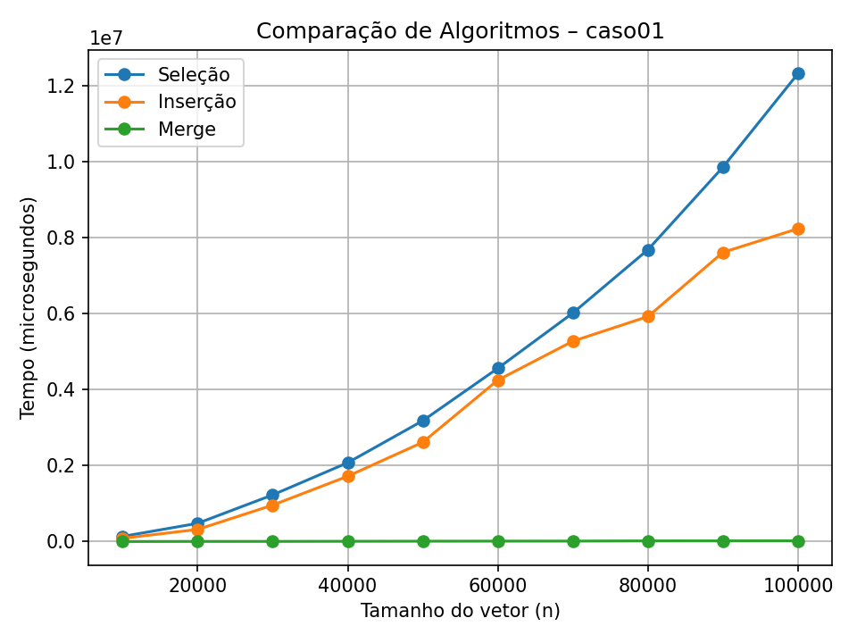
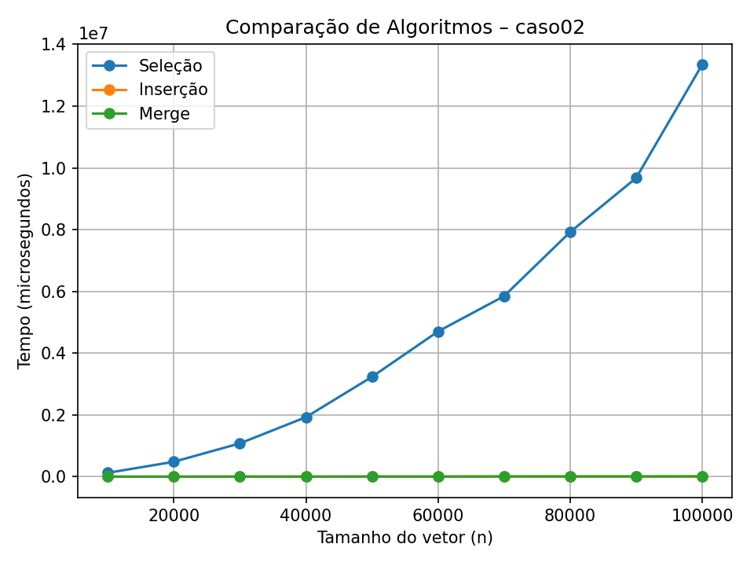
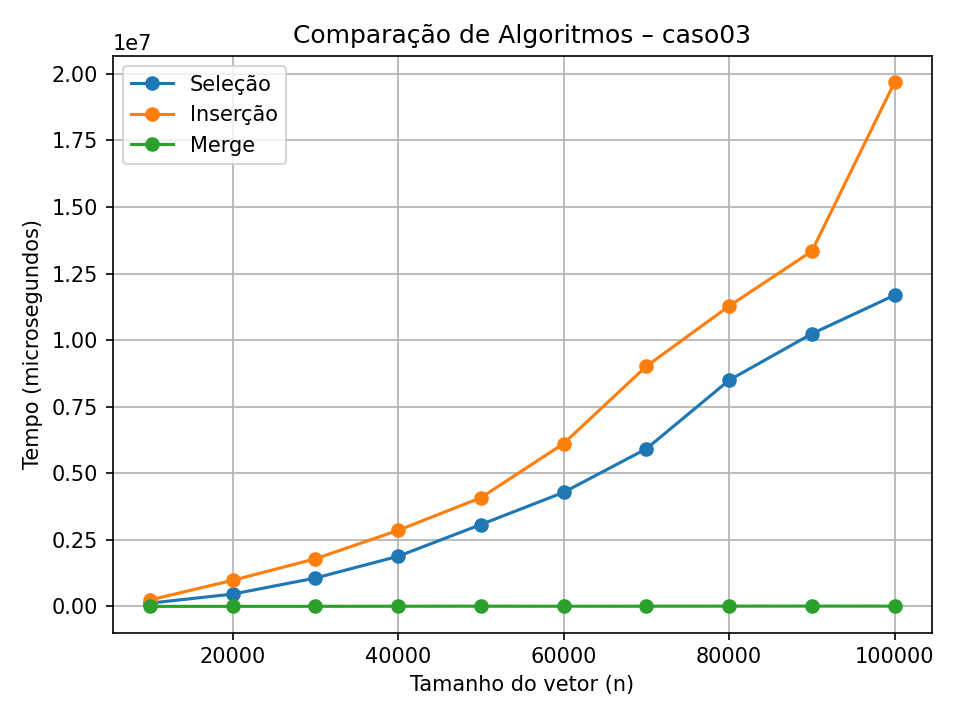
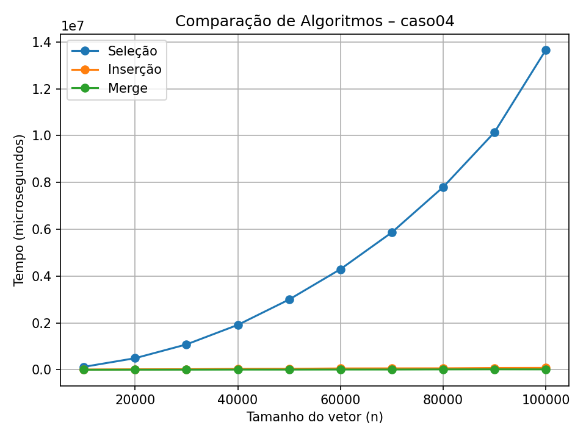
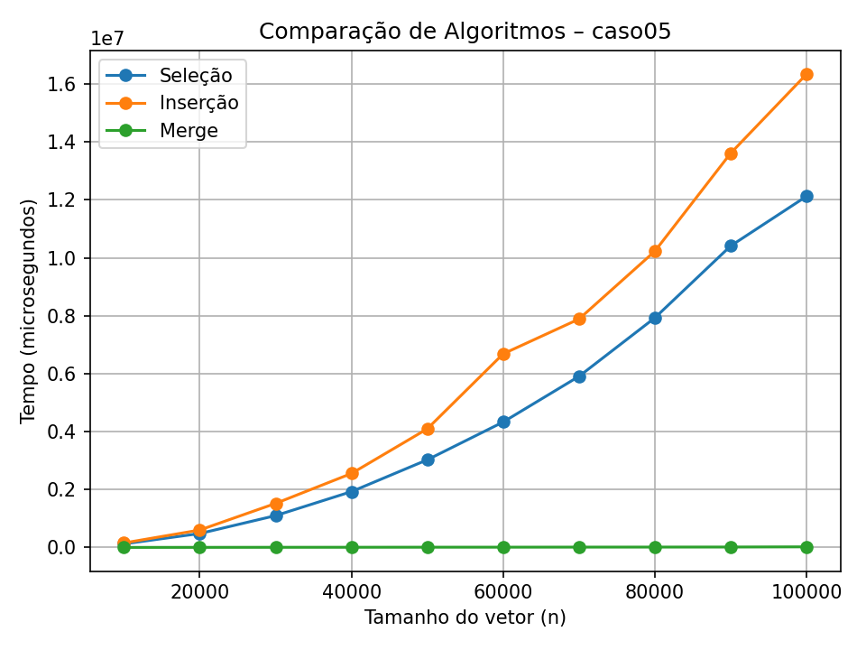

Os seguintes algoritimos de ordenação foram comparados em cinco casos:

  - Seleção - $O(n^2)$
  - Insersão - $O(n^2)$
  - Merge Sort -  $O(n \log n)$

---

Nos casos 2 e 4, merge sort e insersão se mostram muito equivalente em desempenho. 

É percepitivel que insersão se beneficia de arrays quase ordenados e entradas menores, esses são os melhores casos de Insersão, não o pior $O(n^2)$.

Em todos os casos, seleção mostra um crescimento exponencial.

No geral, Merge Sort é o melhor algoritimo em todos os casos.

Os seguintes gráficos gerados com a biblioteca `matplotlib` do Python.

---

## Caso 01

---

## Caso 02

---

## Caso 03

---

## Caso 04

---

## Caso 05

